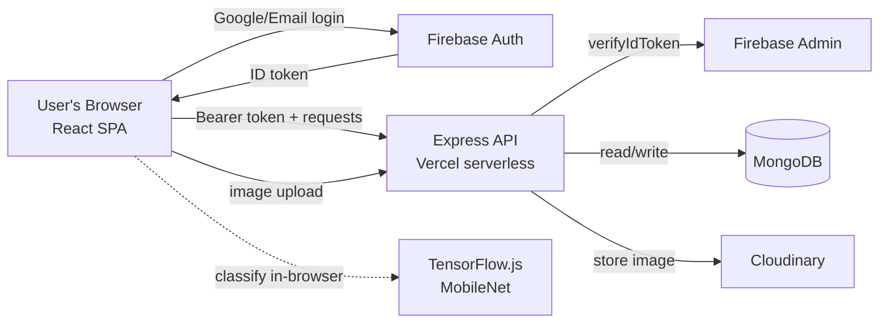
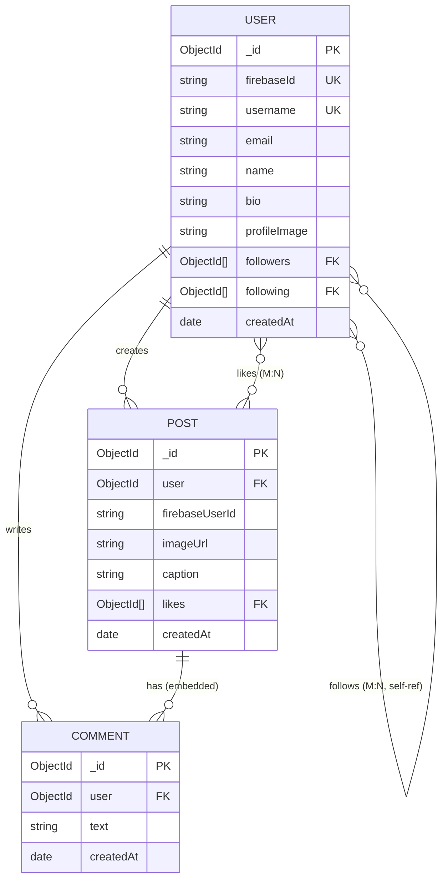
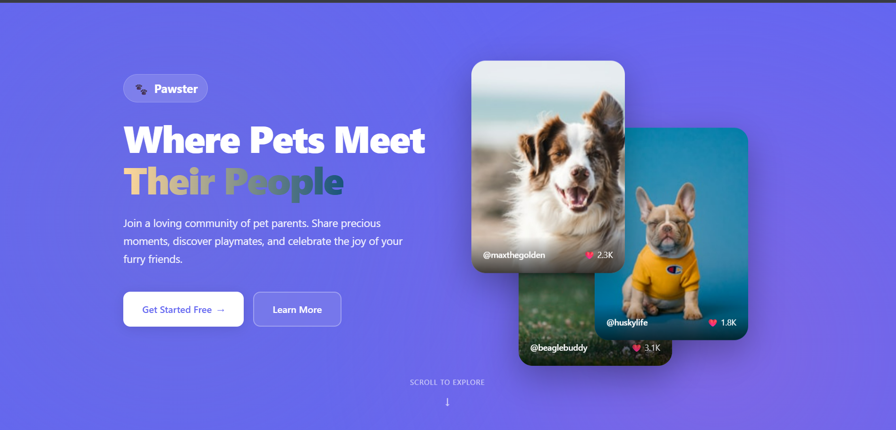
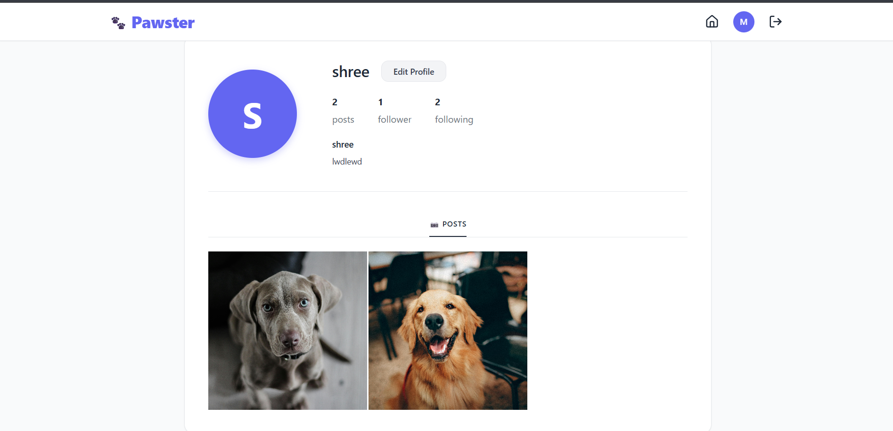

# 🐾 Pawster

A full-stack social platform where dog owners share moments, follow other pet
parents, and interact through likes and comments. Uploads are gated by an
**in-browser AI filter** that only lets genuine dog photos through.

**Live demo:** [pawster-tndx.vercel.app](https://pawster-tndx.vercel.app) &nbsp;·&nbsp; **API:** [pawster-pi.vercel.app](https://pawster-pi.vercel.app)


---

## ✨ Features

- **Authentication** — email/password and Google sign-in via Firebase, with
  email verification and password reset.
- **Posts** — upload a pet photo with a caption; images are stored on Cloudinary.
- **AI image filter** — a COCO-SSD object-detection model runs in the browser and
  only allows a post when it detects a dog or cat (rejecting, e.g., people).
- **Hardened API** — Firebase token verification on protected routes, `helmet`
  security headers, and per-IP rate limiting.
- **Social graph** — follow / unfollow other users, with suggested accounts.
- **Engagement** — like posts (optimistic UI) and comment in real time.
- **Profiles** — editable bio/username, follower/following counts, and a post grid.

## 🧱 Tech Stack

| Layer | Technology |
|---|---|
| Frontend | React 19, Vite, React Router 7 |
| Backend | Node.js, Express 5 (deployed as a Vercel serverless function) |
| Database | MongoDB (Mongoose ODM) |
| Auth | Firebase Authentication (client) + Firebase Admin (server verification) |
| Image storage | Cloudinary (via Multer) |
| Machine learning | TensorFlow.js + COCO-SSD (client-side object detection) |
| Hosting | Vercel (frontend + serverless API) |

## 🏗️ Architecture



The React app authenticates with Firebase and attaches the resulting ID token to
API calls. The Express backend verifies each token with the Firebase Admin SDK,
mirrors the user into MongoDB, and persists posts, likes, comments and the follow
graph. Images never touch the database — they are uploaded straight to Cloudinary.
Image classification runs entirely in the browser, so no image data is sent to a
server for the "is this a dog?" check.

## 🗄️ Data Model



**Design notes:**
- **Comments are embedded** as a subdocument array inside each `Post` — reads are
  fast (one document fetch) and comment volume per post is naturally bounded.
- **Likes and follows are modelled as arrays of ObjectId references** (many-to-many),
  keeping membership checks and toggles simple.
- There is no separate `Pet` collection — a "pet" is represented by the uploaded
  image. Adding a first-class `Pet` entity is a possible future enhancement.

## 📸 Screenshots

> _Add screenshots to `docs/screenshots/` and reference them here._

<!--



-->

## 🚀 Getting Started

### Prerequisites
- Node.js 18+
- A MongoDB database (e.g. MongoDB Atlas)
- A Firebase project (Authentication enabled)
- A Cloudinary account

### 1. Clone
```bash
git clone https://github.com/shreeRCode/Pawster.git
cd Pawster
```

### 2. Backend
```bash
cd backend
npm install
cp .env.example .env      # then fill in real values
npm run dev               # starts on http://localhost:5000
```

### 3. Frontend
```bash
cd ../pawster-frontend
npm install
cp .env.example .env      # then fill in real values
npm run dev               # starts on http://localhost:5173
```

## 🔐 Environment Variables

Never commit real `.env` files — commit only `.env.example`. See each app's
`.env.example` for the full list.

**Backend (`backend/.env`)**

| Variable | Description |
|---|---|
| `PORT` | API port (default 5000) |
| `MONGODB_URI` | MongoDB Atlas connection string |
| `CLOUDINARY_CLOUD_NAME` / `CLOUDINARY_API_KEY` / `CLOUDINARY_API_SECRET` | Cloudinary credentials |
| `FIREBASE_PROJECT_ID`, `FIREBASE_PRIVATE_KEY`, `FIREBASE_CLIENT_EMAIL`, … | Firebase Admin service-account fields |

**Frontend (`pawster-frontend/.env`)**

| Variable | Description |
|---|---|
| `VITE_FIREBASE_API_KEY` | Firebase web API key |
| `VITE_FIREBASE_AUTH_DOMAIN` | Firebase auth domain |
| `VITE_FIREBASE_PROJECT_ID` | Firebase project ID |
| `VITE_FIREBASE_STORAGE_BUCKET` | Firebase storage bucket |
| `VITE_FIREBASE_MESSAGING_SENDER_ID` | Firebase messaging sender ID |
| `VITE_FIREBASE_APP_ID` | Firebase app ID |
| `VITE_FIREBASE_MEASUREMENT_ID` | Firebase analytics measurement ID |

## 📡 API Reference

Base URL: `/api`. Routes marked 🔒 require a Firebase ID token
(`Authorization: Bearer <token>`).

**Posts**

| Method | Endpoint | Auth | Description |
|---|---|:--:|---|
| GET | `/api/posts` | | List all posts (newest first) |
| POST | `/api/posts` | 🔒 | Create a post (`multipart/form-data`: `image`, `caption`) |
| PUT | `/api/posts/:id/like` | 🔒 | Toggle like on a post |
| POST | `/api/posts/:id/comments` | 🔒 | Add a comment (`{ text }`) |

**Users**

| Method | Endpoint | Auth | Description |
|---|---|:--:|---|
| GET | `/api/users` | | List users |
| GET | `/api/users/uid/:uid` | 🔒 | Get a user's profile + posts |
| PUT | `/api/users/edit/:uid` | 🔒 | Edit the authenticated user's profile |
| POST | `/api/users/follow/:id` | 🔒 | Follow a user |
| POST | `/api/users/unfollow/:id` | 🔒 | Unfollow a user |
| GET | `/api/users/suggestions/:uid` | | Get suggested users to follow |
| POST | `/api/users/sync` | | Create/sync the MongoDB user record on login |

## 🤖 AI Image Filter

When a user selects an image, the app lazy-loads **COCO-SSD** (an object-detection
model) via TensorFlow.js and runs it directly in the browser. Unlike a whole-image
classifier, COCO-SSD locates and labels individual objects (dog, cat, person, …)
with confidence scores, so a post is accepted only when a **dog or cat** is
detected above a confidence threshold — a photo containing only a person is
correctly rejected. TensorFlow.js and the model are code-split into their own
bundle chunk, so they are downloaded only the first time a user uploads.

## 📦 Deployment

- **Frontend** is deployed on Vercel from `pawster-frontend/` (Vite static build).
  `vercel.json` rewrites all routes to `index.html` for client-side routing.
- **Backend** is deployed on Vercel as a serverless function (`backend/api/index.js`).
- Environment variables are configured in the Vercel dashboard for each project.

## 🛣️ Roadmap

- [ ] Cursor-based pagination + infinite scroll (currently offset "load more")
- [ ] Direct messages / notifications
- [ ] Distributed rate-limit store (Redis) for multi-instance deployments
- [ ] Delete the Cloudinary image when a post is deleted
- [ ] A dedicated `Pet` entity (breed, age) beyond the photo

## 👩‍💻 Author

Built by [@shreeRCode](https://github.com/shreeRCode).
